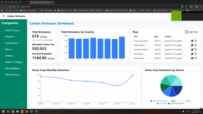
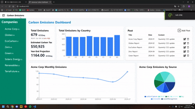
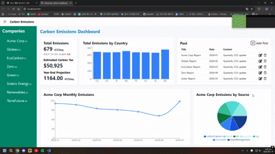
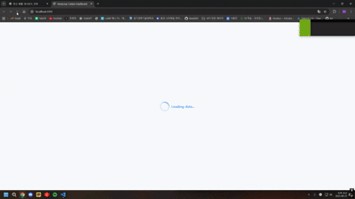
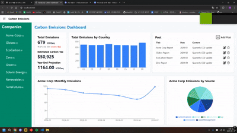

# 탄소 배출량 대시보드 (Carbon Emissions Dashboard)

이 프로젝트는 (주)하나루프의 서류 전형 소규모 프로젝트로 제작된 웹 기반 탄소 배출량을 시각화한 대시보드입니다.
기업별/국가별 배출 현황, 예상 탄소세, 연말 배출량을 추정할 수 있도록 설계되었습니다.

## 기술 스택

- Framework: Next.js 14 (App Router) + React 18 + TypeScript
- Css: TailWind CSS
- 차트: Recharts
- 상태 관리: React hooks (`useState`, `useEffect`)
- Icon: React Icons

## 폴더 구조
project-root/  
├── app/  
│   ├── globals.css               # 전역 스타일  
│   ├── layout.tsx                # Next.js 기본 레이아웃  
│   └── page.tsx                  # 엔트리 페이지 (대시보드 UI로 연결)  
│
├── components/  
│   ├── Charts/  
│   │   ├── CountryBarChart.tsx   # 국가별 총 배출량 바 차트  
│   │   ├── EmissionLineChart.tsx # 월별 배출량 추세 라인 차트  
│   │   └── EmissionPieChart.tsx  # 배출원별 비율 파이 차트  
│   │
│   ├── post/  
│   │   ├── PostModal.tsx         # 게시물 추가/수정 모달  
│   │   └── Posts.tsx             # 게시물 목록 및 CRUD 관리  
│   │
│   ├── Header.tsx                # 상단 헤더 (사이드바 토글 버튼 포함)  
│   ├── Sidebar.tsx               # 회사 목록 사이드바  
│   ├── TotalEmissionsCard.tsx    # 총 배출량/예상 탄소세/연말 예상치 카드  
│   └── ui.tsx                    # 대시보드 메인 레이아웃  
│
├── lib/  
│   ├── api.ts                    # Fake API (조회/생성/수정/삭제, 15% 실패 확률)  
│   ├── seed.ts                   # 초기 데이터 (회사, 국가, 게시물)  
│   └── types.ts                  # 타입 정의 (Company, GhgEmission, Post, Country)  
│
├── public/                       # 정적 리소스  
│
├── node_modules/                 # 패키지 모듈  
├── package.json                  # 프로젝트 설정 및 의존성  
└── README.md                     # 프로젝트 설명 문서  

## 주요 기능

- 대시보드 레이아웃
  - 사이드바: 회사 목록 및 선택
  - 헤더: 네비게이션
  - 메인 영역: 여러가지 차트와 카드 배치

- 배출량 시각화
  - 총 배충량 카드 (목표 대비 %)
  - 예상 탄소세 계산 (가상의 수치 * 배출량 )
  - 연말 예상 배출량 (선택된 회사의 Total Emissions / emissions.length * 12)
  - 월별 추세 라인 차트와 파이 차트
  - 국가별 바 차트

- 게시물(Post) 관리
  - 월별/회사별 가상의 데이터 보고서 목록 표시
  - Post 추가 / 수정 / 삭제 기능
  - Fake backend 연동 
  - 롤백 처리

- 에러/로딩 처리
  - 전역 로딩 스피너
  - 실패 시 에러 UI (빨간 박스 알림)
  - 데이터 없음 상태 처리 (“데이터 없음” 표시)

---

## 실행 방법

1.저장소 클론
  - git clone https://github.com/blueA003/hanaloop-carbon-dashboard.git
  - cd carbon-emissions-dashboard

2. 설치
  - npm install

3. 실행
  - npm run dev

4. 접속
  - http://localhost:3000

## 가정 및 구현 메모

- 탄소세 계산
  - 총 배출량 x $75 (가정치)
  - 실제 세금량이나 계산식이 아닌 단순 계산식

- 연말 예상 배출량
  - 현재 월별 평균 (선택된 회사의 Total Emissions / emissions.length) x 12개월
  - 추세 감지를 위한 단순 계산

- backend + api + seed + type
  - 예시를 그대로 활용하며 추가 수정하여 사용
  - 실패 확률: 15% (예외 테스트 목적)
  - 실제 서버는 없으며 클라이언트에서 상태 관리

- 디자인 의도
  - 환경에 관련된 대시보드이면서 또한 회사에서 사용하는 대시보드라면 장시간 사용하되 최대한 밝은 색상과 환경에 관련된 색상 사용

- 데이터 흐름
  - seed.ts로 초기 데이터를 정의합니다
  - api.ts
    - 데이터를 불러오고 실제 서버와 유사한 API 동작을 흉내냅니다. 
    - 제공 함수는 fetchCompanies, fetchCountries, fetchPosts로 조회하며 createOrUpdatePost, deletePost 생성, 수정, 삭제을 제공합니다.
  -ui.tsx(최상위 컴포넌트)
    - fetchCompanies를 호출하여 상태 저장합니다.
    - 로딩/에러에 따라 화면을 보여줍니다.
  - 하위 컴포넌트(시각화 차트, 카드, 게시물 등등)
    - companies 또는 posts 데이터를 Props로 전달 받아 화면에 표시합니다.

- 소요 시간
  - 약 12~ 14시간(3일)
  - 기획 -> 구현 -> 에러/로딩 처리 -> 문서화

## 아키텍처 개요
- ui.tsx: 전체 레이아웃 관리, 전역 fetch & 사이드바 상태, 로딩/에러 처리
- Sidebar.tsx: 회사 목록 사이드바, 회사 선택 시 대시보드 갱신
- Header.tsx: 상단 헤더, 사이드바 토글 버튼 제공
- TotalEmissionsCard.tsx: 선택된 회사의 총 배출량, 예상 탄소세, 연말 예상치 계산 및 표시
- EmissionLineChart.tsx: 선택된 회사의 월별 배출량 추세 (LineChart)
- EmissionPieChart.tsx: 선택된 회사의 배출원별 비율 (PieChart)
- CountryBarChart.tsx: 전체 회사 데이터를 국가 단위로 합산 (BarChart)
- Posts.tsx: 게시물 목록 표시, Post 추가/수정/삭제 기능 + Modal로 구현
- PostModal.tsx: 게시물 생성/수정을 위한 입력 폼 (Modal)
- api.ts: seed 데이터를 기반으로 fake API 구현 (조회/생성/수정/삭제, 15% 실패 확률)
- seed.ts: 초기 회사, 국가, 게시물 데이터 정의
- types.ts: TypeScript 타입 정의 (Company, Emission, Post, Country)

## 개선 방향
- 실제 백엔드 연동: 새로고침 이후에도 데이터(추가·수정·삭제)가 유지되도록 서버와 연결
- 인증/권한 관리(Auth): 로그인 기능을 통해 관리자와 일반 사용자를 구분하여 사용 가능하도록 구현
- 에러 처리 강화: 각 차트 및 데이터 아이템별로 개별적인 에러 핸들링 제공
- 게시판 고도화: 더 많은 정보를 담은 게시판 기능 구현
- 게시판 페이지 추가: Post 제목 클릭 시 해당 게시판 상세 페이지로 이동하도록 개선
- 실시간 연동: API 서버와 연결하여 실제 배출량 반영
- 검색 및 필터 기능 추가: 원하는 기업·국가·기간을 빠르게 조회할 수 있도록 검색창과 필터 제공
- 반응형 개선: 다양한 화면 크기에서 더 자연스럽게 동작하는 반응형 웹으로 개선
- 글꼴 변경: 부드럽고 가독성 높은 폰트를 적용하여 UI 일관성과 사용자 경험 개선

## 실행 화면

## 1. 사이드바 동작

### 2. 차트 시각화

## 3. 게시물(Post) 기능

## 4. 로딩 화면

## 5. 에러 화면
